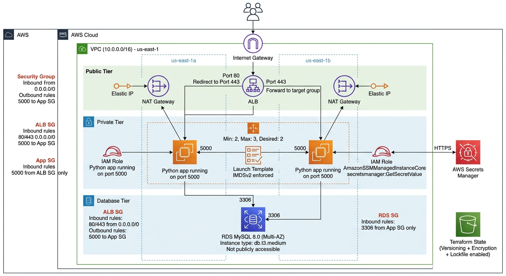
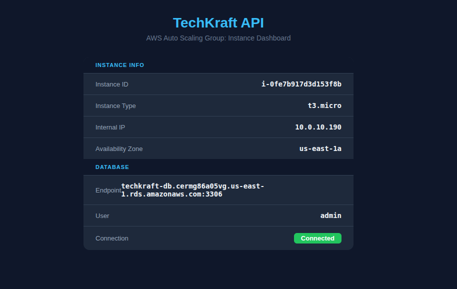
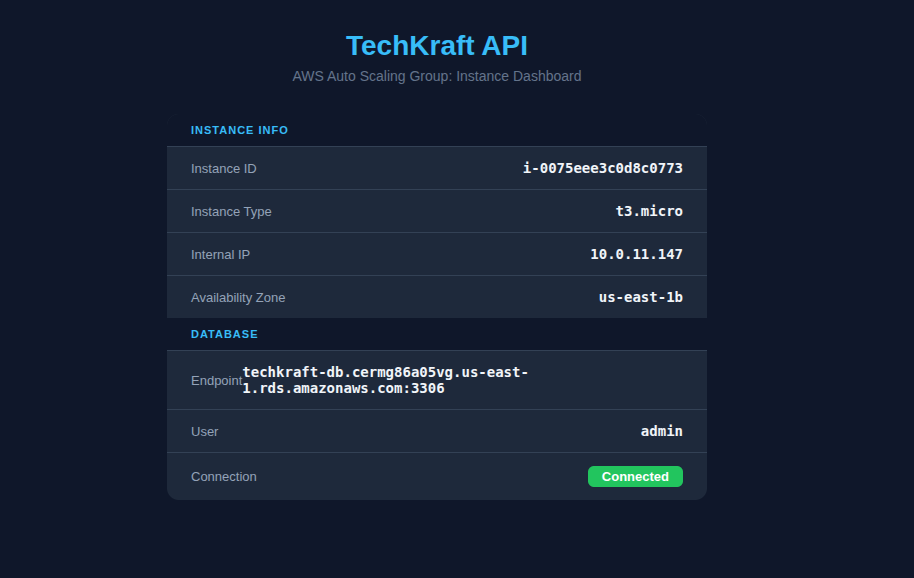

# Terraform Setup
- Clone Project Locally:
    ```sh
    git clone https://github.com/TheSpiritMan/Techkraft-DevOps-Challenge.git
    cd Techkraft-DevOps-Challenge
    ```
## AWS Architecture



---
## S3 Bucket
- We are using AWS S3 bucket as a remote backend storage for our terraform to store state files.
- Create AWS S3 bucket named `techkraft-tfstate` :
    ```sh
    aws s3api create-bucket \
    --bucket techkraft-tfstate \
    --region us-east-1 
    ```
- Enable Versioning in our S3 Bucket:
    ```sh
    aws s3api put-bucket-versioning \
    --bucket techkraft-tfstate \
    --versioning-configuration Status=Enabled
    ```
---
## Terraform:
- All our IaC are written inside `Terraform-Files(Optional)` directory.
    ```sh
    cd Terraform-Files\(Optional\)  
    ```
- I have manage Terraform[IaC] code into separate modules. They are:
    - [secrets](./terraform/modules/secrets/): For storing proper secret inside AWS Secret Manager
    - [iam](./terraform/modules/iam/): For appropriate Roles and Permissions.
    - [vpc](./terraform/modules/vpc/): For actual Private Network with specific CIDR.
    - [database](./terraform/modules/database/): For actual MySQL Database 
    - [compute](./terraform/modules/compute/): For actual computation workload like ECS Cluster, ECS Task Definition, ECS Auto Scaling and so on.

- Terraform basic files are:
    - [main.tf](./terraform/main.tf): Define `aws` as a provider and set SDK version
    - [backend.tf](./terraform/backend.tf): Define `S3` as remote backend storage
    - [outputs.tf](./terraform/outputs.tf): Define output variable which will be useful for us.


- Copy paste `terraform.tfvars.example` into `terraform.tfvars`.
    ```sh
    cp terraform.tfvars.example terraform.tfvars
    ```
- Update values accordingly in this new [terraform.tfvars](./Terraform-Files(Optional)/terraform.tfvars) file.

- Initialize Terraform. Basically this command download our cloud provider sdk and start creating state file for our terraform resource.
    ```sh
    terraform init
    ```
    Output:
    ```sh
    Initializing the backend...
    
    Successfully configured the backend "s3"! Terraform will automatically
    use this backend unless the backend configuration changes.
    Initializing modules...
    - compute in modules/compute
    - database in modules/database
    - iam in modules/iam
    - secrets in modules/secrets
    - vpc in modules/vpc
    Initializing provider plugins...
    - Finding hashicorp/aws versions matching "~> 6.0"...
    - Finding hashicorp/random versions matching "~> 3.8"...
    - Installing hashicorp/aws v6.43.0...
    - Installed hashicorp/aws v6.43.0 (signed by HashiCorp)
    - Installing hashicorp/random v3.8.1...
    - Installed hashicorp/random v3.8.1 (signed by HashiCorp)
    Terraform has created a lock file .terraform.lock.hcl to record the provider
    selections it made above. Include this file in your version control repository
    so that Terraform can guarantee to make the same selections by default when
    you run "terraform init" in the future.
    
    Terraform has been successfully initialized!
    
    You may now begin working with Terraform. Try running "terraform plan" to see
    any changes that are required for your infrastructure. All Terraform commands
    should now work.
    
    If you ever set or change modules or backend configuration for Terraform,
    rerun this command to reinitialize your working directory. If you forget, other
    commands will detect it and remind you to do so if necessary.
    ```

- Fix terraform formatting issue:
    ```sh
    terraform fmt
    ```

- Validate terraform files:
    ```sh
    terraform validate
    ```
---
### Provision Secret
- Plan provision `secrets` module only at the moment.
    ```sh
    terraform plan -target=module.secrets
    ```
- Above command will show us what changes will apply into our cloud infrastructure.
- Apply above `secrets` module:
    ```sh
    terraform apply -target=module.secrets
    ```

    Output:
    ```sh
    Do you want to perform these actions?
    Terraform will perform the actions described above.
    Only 'yes' will be accepted to approve.
    Enter a value: 
    ```
- Here, it will ask for confirmation. We have pass `yes` then only it will start creating provisioning.
- On success, it will get below as output:
    ```sh
    db_secret_arn = "arn:aws:secretsmanager:us-east-1:336129194463:secret:techkraft-devops-challenge-db-credentials-CTIYKw"
    ```
---
### Provision IAM
- We are configuring AWS SSM to get Shell access.
- Plan provision `iam` module only at the moment.
    ```sh
    terraform plan -target=module.iam
    ```
- Above command will show us what changes will apply into our cloud infrastructure.
- Apply above `iam` module:
    ```sh
    terraform apply -target=module.iam
    ```

    Output:
    ```sh
    Do you want to perform these actions?
    Terraform will perform the actions described above.
    Only 'yes' will be accepted to approve.
    Enter a value: 
    ```
- Here, it will ask for confirmation. We have pass `yes` then only it will start creating provisioning.
- On success, it will get below as output:
    ```sh
    ec2_role_arn = "arn:aws:iam::336129194463:role/techkraft-ec2-role"
    instance_profile = "techkraft-ec2-profile"
    ```
---
### Provision VPC
- This module contains all the networking services. 
- Here we are provisioning below resources:
    - 1 VPC Network: For Entire Region
    - 1 Internet Gateway: For Inbound and Outbound Traffic
    - 2 Public Subnet: For ALB and NAT Gateway
    - 4 Private Subnet: Each for EC2 and RDS 2 Different AZs
    - 2 NAT Gateway: For Outbound Traffic for 2 different AZs
    - 3 Route Table: 1 for Internet Gateway and 2 for NAT Gateway

- Plan provision `vpc` module only at the moment.
    ```sh
    terraform plan -target=module.vpc
    ```
- Above command will show us what changes will apply into our cloud infrastructure.
- Apply above `vpc` module:
    ```sh
    terraform apply -target=module.vpc
    ```

    Output:
    ```sh
    Do you want to perform these actions?
    Terraform will perform the actions described above.
    Only 'yes' will be accepted to approve.
    Enter a value: 
    ```
- Here, it will ask for confirmation. We have pass `yes` then only it will start creating provisioning.
- On success, it will get below as output:
    ```sh
    nat_gateways = {
      "az1" = {
        "id" = "nat-0c9ba86de72050d3d"
        "public_ip" = "44.217.38.26"
        "subnet_id" = "subnet-0a52998bb6f04e283"
      }
      "az2" = {
        "id" = "nat-02256652a8dfc58f0"
        "public_ip" = "3.232.122.232"
        "subnet_id" = "subnet-008759533935e123b"
      }
    }
    private_db_subnets = [
      "subnet-04ea159670ee1e50a",
      "subnet-057b4e68aecd34813",
    ]
    private_ec2_subnets = [
      "subnet-0ebd2d12a5657805e",
      "subnet-031cbe6b6180c9cba",
    ]
    public_subnets = {
      "az1" = "subnet-0a52998bb6f04e283"
      "az2" = "subnet-008759533935e123b"
    }
    vpc_id = "vpc-02ac2f42d1dd23e94"
    ```
---
### Provision Database
- This module contains all the computing resources. 
- Here we are provisioning below resources:
    - 1 Security Group: For RDS
    - 1 Private Subnet: For RDS

- Plan provision `database` module only at the moment.
    ```sh
    terraform plan -target=module.database
    ```
- Above command will show us what changes will apply into our cloud infrastructure.
- Apply above `database` module:
    ```sh
    terraform apply -target=module.database
    ```

    Output:
    ```sh
    Do you want to perform these actions?
    Terraform will perform the actions described above.
    Only 'yes' will be accepted to approve.
    Enter a value: 
    ```
- Here, it will ask for confirmation. We have pass `yes` then only it will start creating provisioning.
- On success, it will get below as output:
    ```sh
    db_endpoint = "techkraft-db.cermg86a05vg.us-east-1.rds.amazonaws.com:3306"
    ```
---
### Provision Compute
- This module contains all the computing resources. 
- Here we are provisioning below resources:
    - 2 Security Groups: For ALB, ECS
    - 1 AWS LB
    - 1 AWS LB Target Group
    - 1 AWS LB Listener
    - Instance Template
    - Autoscaling Group

- Plan provision `compute` module only at the moment.
    ```sh
    terraform plan -target=module.compute
    ```
- Above command will show us what changes will apply into our cloud infrastructure.
- Apply above `compute` module:
    ```sh
    terraform apply -target=module.compute
    ```

    Output:
    ```sh
    Do you want to perform these actions?
    Terraform will perform the actions described above.
    Only 'yes' will be accepted to approve.
    Enter a value: 
    ```
- Here, it will ask for confirmation. We have pass `yes` then only it will start creating provisioning.
- On success, it will get below as output:
    ```sh
    alb_dns = "techkraft-alb-133054039.us-east-1.elb.amazonaws.com"
    ```
---
### Complete Terraform Output
- Our complete Terraform output will look like below:
    ```sh
    alb_dns = "techkraft-alb-133054039.us-east-1.elb.amazonaws.com"
    db_endpoint = "techkraft-db.cermg86a05vg.us-east-1.rds.amazonaws.com:3306"
    db_secret_arn = "arn:aws:secretsmanager:us-east-1:336129194463:secret:techkraft-devops-challenge-db-credentials-CTIYKw"
    ec2_role_arn = "arn:aws:iam::336129194463:role/techkraft-ec2-role"
    instance_profile = "techkraft-ec2-profile"
    nat_gateways = {
      "az1" = {
        "id" = "nat-0c9ba86de72050d3d"
        "public_ip" = "44.217.38.26"
        "subnet_id" = "subnet-0a52998bb6f04e283"
      }
      "az2" = {
        "id" = "nat-02256652a8dfc58f0"
        "public_ip" = "3.232.122.232"
        "subnet_id" = "subnet-008759533935e123b"
      }
    }
    private_db_subnets = [
      "subnet-04ea159670ee1e50a",
      "subnet-057b4e68aecd34813",
    ]
    private_ec2_subnets = [
      "subnet-0ebd2d12a5657805e",
      "subnet-031cbe6b6180c9cba",
    ]
    public_subnets = {
      "az1" = "subnet-0a52998bb6f04e283"
      "az2" = "subnet-008759533935e123b"
    }
    vpc_id = "vpc-02ac2f42d1dd23e94"
    ```
---
### Visit Sample Site

- Here, if we visit the link of `alb_dns` i.e [techkraft-alb-1105755562.us-east-1.elb.amazonaws.com](techkraft-alb-1105755562.us-east-1.elb.amazonaws.com), we can see page like below:

    
- In above page, the `Internal IP`, `Availability Zone` and `Instance ID`.
- When we refresh page, we will get request from another EC2 instance:

    

> Addon: Now you can continue reading to [Access-EC2-Shell.md](./Access-EC2-Shell.md) and [Terraform-Cleanup.md](./Terraform-Cleanup.md) file for more information.

---